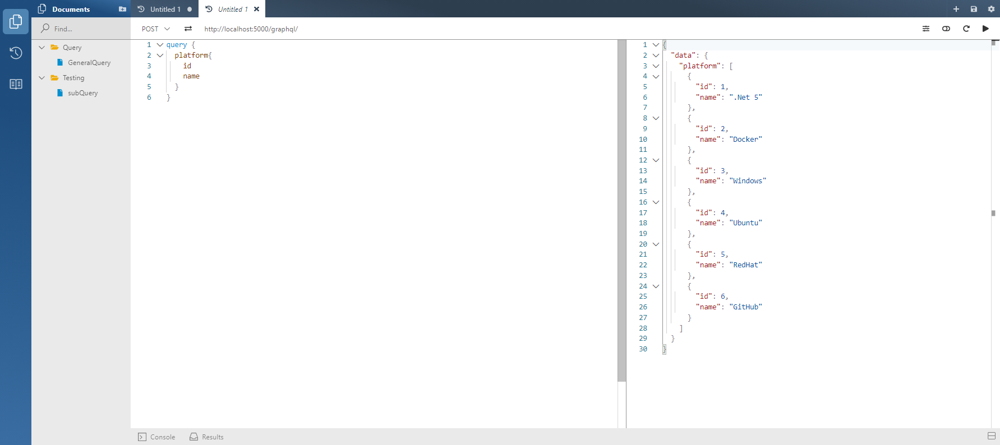

# CommanderGQL
**Example of using GraphQL and Hot Chocolate**

Nothing really special here. This repo explores using GraphQL with HotChocolate.
  This shows doing Queries, Mutations, and a sample subscription.
  
With this example the main API url is http://localhost:5000/graphql > 
> *Remember that one must do a POST when using GraphQL* (even when doing a GET)

   *Voyager*
 
The Voyager Data Diagram accessed from: http://localhost:5000/graphql-voyager when the App is running


This web inteface will allow one walk the data models in the code and see relationships for Queries, Mutations, etc.

To test the API, one should really try Insomnia https://insomnia.rest/. This API tester appears to have a good interface for running API endpoints. But of course this is not required. When using Hot Chocolate, there is an interface that comes built in.

The "Banana Cake Pop" found on http://localhost:5000/graphql/



**Some GraphQL Examples:**

Queries:

 -Plain get some data
```sql

  query{
  commands{
    id
    howTo
    commandLine
    platform{
      name
    }
  }
}
```
-Doing some sorting
```sql
query {
  platform(order: {name: DESC})
  {
    name
  }
}
```
-Doing a filter
```sql
query{
  commands(where: {platformId: {eq: 1}} ){
    id
    howTo
    commandLine
    platform{
      name
      id
    }
  }
}
```

Mutations (adding data to the Db):
```sql
mutation{
  addPlatform(input:
  { name: "GitHub"
  })
  {
    platform
    {
      id
      name
    }
  }
}
```    

Enjoy 😎  ~ScottGeek
